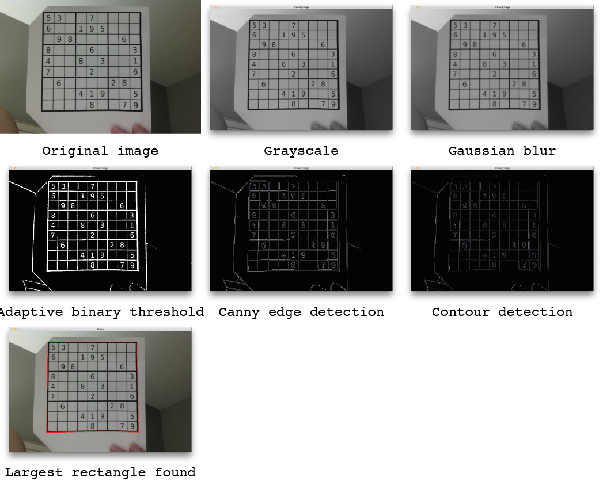
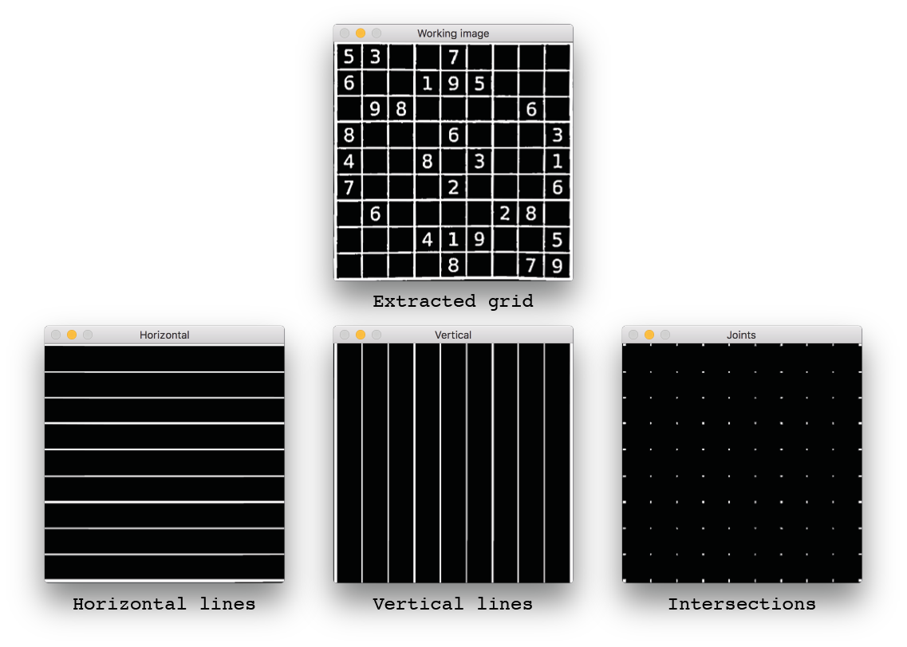
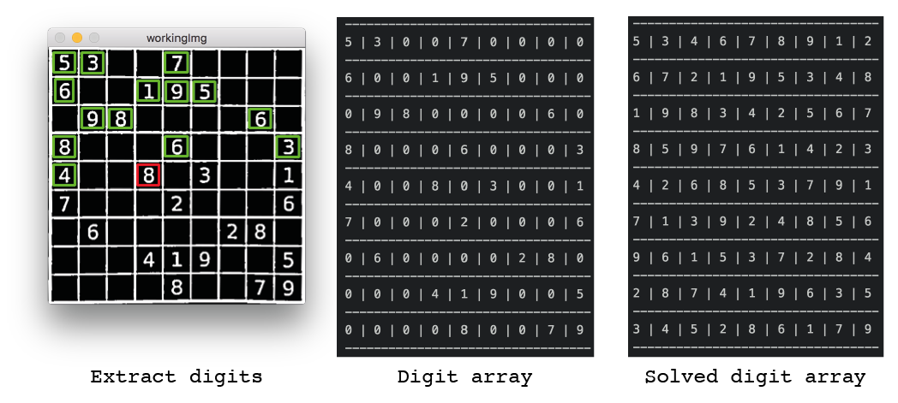
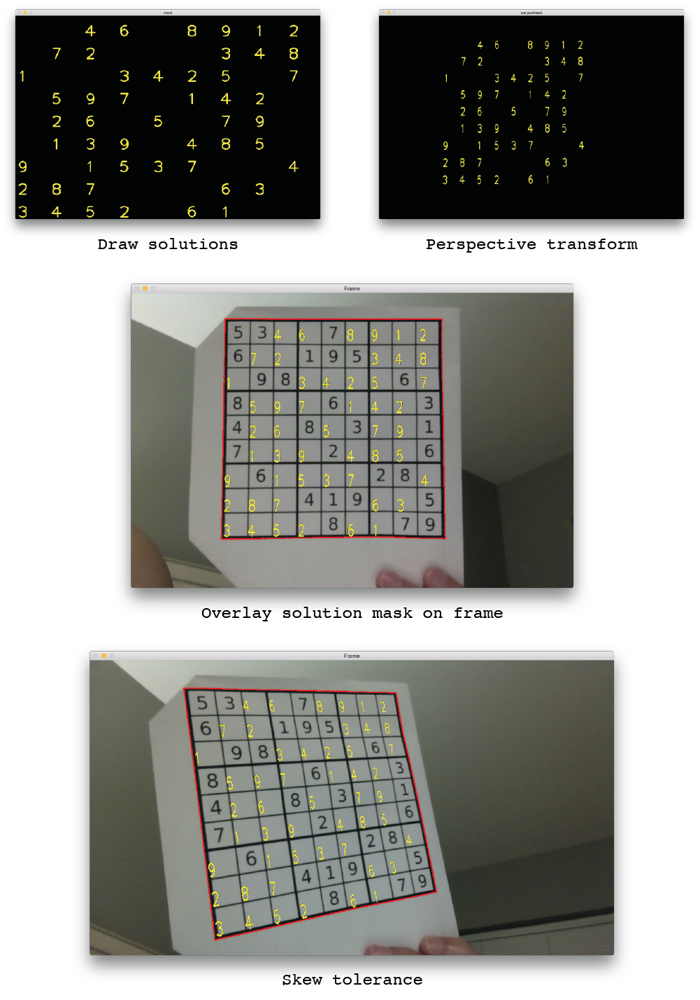

# sudoku-vision

> sudoku-vision is an augmented reality application that displays the answer to sudoku puzzles when you hold them up to your webcam.

Each frame from the webcam undergoes a number of processing steps to extract the sudoku grid.


If the grid is successfully located, it is extracted and processed further to verify that it is a sudoku puzzle by looking for 81 smaller squares.


In the workflow for creating sample optical character recognition (OCR) data, each digit is highlighted in order as the user types in their identities.
In the solving workflow, the program identifies each digit in lexicographical order. The puzzle is then solved using backtracking search.


The correct digits for the blanks are drawn on an overlay frame, which is transformed to fit the largest rectangle that was
discovered in the first step. The solution is then overlaid on the frame. The last example shows the current level of skew tolerance.



## Requirements

* [CMake](https://cmake.org) 3.5 or higher
* [Compiler compatibility](http://en.cppreference.com/w/cpp/compiler_support) with C++11
* [OpenCV](https://github.com/opencv/opencv) 3.1.0

## Running the application

Compile:

```sh
cmake . && make main
```

Run:

```sh
./main
```

## Future work
* Separate sample OCR data creation and training from cell detection workflow
* Optimize digit recognition
* Improve digit drawing
* Improve detection of faded or faint grid lines
* Unit testing
* Add additional solving algorithms:
  * [Knuth's dancing links](https://www.ocf.berkeley.edu/~jchu/publicportal/sudoku/sudoku.paper.html)
  * [Norvig's constraint propagation method](http://norvig.com/sudoku.html)

## License

This project is licensed under terms of the MIT License.
